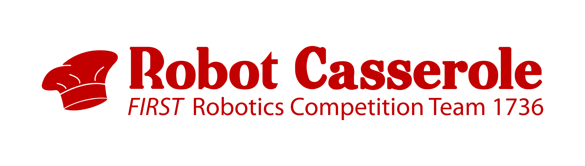

# RobotCasserole2022 🍲
Software for Robot Casserole's 2022 FIRST Rapid React 🔋 Competition Season

## Contents
1. Driver View
2. Main Source Code
3. Log File Snagger & Log Viewer
4. Spooky Scary LocalHost Link
5. Necessary Fractal

## 1. Driver View Website
  The Driver View web site is used to help test and tweak our code, and used to help drive team during match. The driver view is a javascript/HTML based viewer of data logs captured from the robot during operation. These data logs are then used to tweak code before, during, and after competition. 

## 2. Main Source Code

  What we currently have for our 2022 Robot Code is a fully functioning swerve drive and a simplistic photonvision ball allignment.  In addition we have worked on improving the quality of life for the Robot Dashboard.  A 2, 3, and 4 ball auto has been produced in simulation with the code, as well as a fully mapped out teleoperated controller.  We have rough simulated code for the robot that allows it to climb.
   [here](https://github.com/RobotCasserole1736/RobotCasserole2022/tree/main/RobotCode).

## 3. Log File Snagger & Log Viewer
  The log file snagger is a python script used to  communticate with the roborio and grab all csv logs in a certain directory and put them in a log viewer where we can view them when the robot does somthing wacky.
  
## 4. LocalHost website 
  Here is a link to the localhost website used for sims and robot testing.  Some minor updates have occured but otherwise it is the classic website.
  (Just a heads up you'll need running code in simulation for the link to work.)
  [Click here if you dare](http://localhost:5805/)

## 5. ATTENTION!!! Benoit Mandelbrot Made This
   

